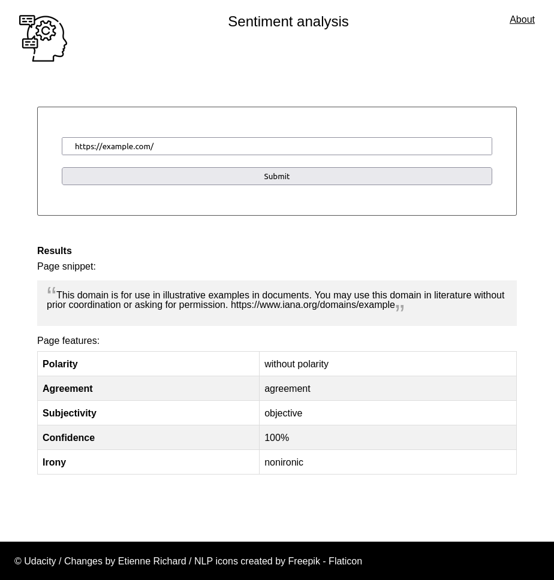

# Project 4 — Evaluate a News Article with Natural Language Processing

This repository contains the code for Project 4 — _Evaluate a News Article with Natural Language
Processing_ of the Udacity Nanodegree Front End Web Developer (2023-2024).

**ⓘ Note:** This project is based on the starter project at
https://github.com/udacity/fend/tree/refresh-2019/projects/evaluate-news-nlp. The original README
has been kept as-is in [README.original.md](./README.original.md).

Content:

- [1. Instructions](#instructions)
  - Installation
  - Configuration
  - Running in development
  - Running in production
  - Running the tests
  - Formatting and linting the code
- [2. Design notes](#design-notes)
- [3. Sources and assets](#sources-and-assets)
- [4. Additional references](#additional-references)
- [5. Tools used](#tools-used)
- [6. How to use Dev Containers](#how-to-use-dev-containers)

<a id="instructions"></a>

## Instructions

See the original README in [README.original.md](./README.original.md).

This project consists of 2 components:

- **Front-end**: The front-end is a single page application (SPA). It allows the user to enter the
  URL of a page on which to perform sentiment analysis, and displays the results of the analysis.
- **Back-end**: The back-end is an API. It is responsible for performing the actual sentiment
  analysis using a 3rd party service. In this iteration of the course, the 3rd party service is
  https://www.meaningcloud.com/. You can create a developer account
  [here](https://www.meaningcloud.com/developer/create-account). The documentation of the Sentiment
  Analysis is [here](https://www.meaningcloud.com/developer/sentiment-analysis).

Here is a screenshot of the front-end.



### Installation

This projet is built with [Node.js](https://nodejs.org/) (version 20) and managed with `npm`. For
convenience, it was developed using [Development Containers](https://containers.dev/), but this is
not a hard requirement. Any local installation of a suitable verison of Node (e.g., with
[nvm](https://github.com/nvm-sh/nvm)) should work.

To install all the dependencies:

```bash
npm install
```

### Configuration

The back-end reads your MeaningCloud API key from a [_.env_](https://www.npmjs.com/package/dotenv)
file:

- Create a _.env_ file at the root of the project.
- Configure your API key:
  ```shell
  MEANING_CLOUD_API_KEY="<your-API-key>"
  ```

### Run in development

**Option 1.** Run the project using the
[Webpack Development Server](https://webpack.js.org/configuration/dev-server/):

- Open a 1st shell and start serving the front-end with the Webpack Development Server:
  ```bash
  # Shell 1.
  npm run serve-dev
  ```
- Open a 2nd shell and start the back-end:
  ```bash
  # Shell 2.
  npm run start-dev
  ```
- Open a browser and navigate to http://localhost:8080/ (should be automatic if you are using Visual
  Studio Code).

This option is best suited for quick development as changes are immediately reflected in the UI
thanks to Hot Module Reloading (HMR).

**Option 2.** Run the project using the back-end to serve a full development build:

- Open a shell, make a development build and start the back-end:
  ```bash
  npm run build-dev
  npm run start-dev
  ```
- Open a browser and navigate to http://localhost:3000/ (should be automatic if you are using Visual
  Studio Code).

### Running in production

Run the project using the back-end to serve a full production build:

- Open a shell, make a production build and start the back-end:
  ```bash
  npm run build-prod
  npm run start-prod
  ```
- Open a browser and navigate to http://localhost:3000/ (should be automatic if you are using Visual
  Studio Code).

### Running the tests

Units tests use [Jest](https://jestjs.io/).

To run the tests:

- Open a shell.
  ```bash
  npm run test
  ```

### Formatting and linting the code

#### Formatting

We use [Prettier](https://prettier.io/) for formatting most files:

- See the [_.prettierrc_](./.prettierrc) file at the root of the project.
- To manually format all files:
  ```bash
  # At the root of the project.
  npx prettier --write .
  ```

**Note:** We use the
[prettier-plugin-organize-attributes](https://www.npmjs.com/package/prettier-plugin-organize-attributes)
plug-in to automatically reorder the attributes of HTML elements.

We use [Stylelint](https://stylelint.io/) for formatting styles sheets (_\*.css_, _\*.scss_ and
_\*.sass_ files):

- See the [_.stylelintrc.json_](./.stylelintrc.json) file at the root of the project.
- To manually format all style sheets:
  ```bash
  # At the root of the project.
  npx stylelint --fix "./src/client/styles/*.{css,scss,sass}"
  ```

**Note:** We use the
[stylelint-config-idiomatic-order ](https://github.com/ream88/stylelint-config-idiomatic-order)
plug-in to automatically reorder CSS properties according to
[Principles of writing consistent, idiomatic CSS](https://github.com/necolas/idiomatic-css#declaration-order).

#### Linting

We use [ESLint](https://marketplace.visualstudio.com/items?itemName=dbaeumer.vscode-eslint) for
linting _\*.js_ files.

Moreover, since Visual Studio Code come with language support for JavaScript and TypeScript. We put
`// @ts-check` at the top of all JavaScript files to benefit from the power of the TypeScript
compiler. See
[_JS Projects Utilizing TypeScript_](https://www.typescriptlang.org/docs/handbook/intro-to-js-ts.html).
In summary, all source _\*.js_ files should start with:

```javascript
// @ts-check
'use strict';
```

<a id="design-notes"></a>

## Design notes

### Front-end

As mentioned above, the front-end is a single page application (SPA). It allows the user to enter
the URL of a page on which to perform sentiment analysis, and displays the results of the analysis.

The normal flow is:

- The front-end sends a request with the target URL to the back-end.
- The back-end performs sentiment analysis on the target page.
- The back-end sends a response back to the front-end.
- The front-end updates the page to present the results.

We try to handle the following classes of errors:

- Invalid user input (e.g., maformed target URL).
- Network issues. One measure is to have strict timeouts on all `fetch()` calls using an
  `AbortController` and `setTimeout()`.
- Errors reported by the back-end (client errors, internal errors, etc.).

Implementation:

- The front-end is implemented as a hand-rolled single page application (SPA).
- The project is managed and bundled with [Webpack 5](https://webpack.js.org/). Common settings are
  factored out in a separate _webpack.common.mjs_. The setup is based on the free
  [Webpack 5 Fundamentals](https://www.udemy.com/course/webpack-5-fundamentals/) tutorial by Robert
  Guss.
- Styles are managed with [Sass](https://sass-lang.com/).
- The front-end is turned into a
  [Progressive Web Application](https://webpack.js.org/guides/progressive-web-application/) (PWA) by
  adding Service Workers (SW) with [Workbox](https://github.com/GoogleChrome/workbox).
- We use features of the latest version of JavaScript (ECMAScript) and Babel with
  [@babel/preset-env](https://babeljs.io/docs/babel-preset-env) to transpile to an older version.
- We use [ECMAScript Modules](https://nodejs.org/docs/latest-v20.x/api/esm.html) (ESM) instead of
  [CommonJS Modules](https://nodejs.org/docs/latest-v20.x/api/modules.html) (CJS).

Tests:

- Units tests use [Jest](https://jestjs.io/).
- We use a few additional modules:
  - https://www.npmjs.com/package/jest-fetch-mock for testing functions that make use of `fetch()`
    calls.
  - https://www.npmjs.com/package/jest-environment-jsdom for testing function that update the DOM.

### Back-end

As mentioned above, the back-end is an API. It is responsible for performing the actual sentiment
analysis using a 3rd party service. In this iteration of the course, the 3rd party service is
https://www.meaningcloud.com/.

The normal flow for the `/analyze-sentiment`endpoint is:

- The back-end receives a request from the client.
- The back-end validates the request (and immediately sends an error response if needed).
- The back-end sends a request with the target URL and other arguments to the Sentiment Analysis
  API.
- The Sentiment Analysis API sends a response back to the back-end.
- The back-end processes the response. This mostly involes: (a) Reformatting the response to match
  our own interface. (b) Mapping error codes specifc to the Sentiment Analysis API to our own error
  messages. This would make it possible to swap the 3rd party service in the future.
- The back-end sends a response with the results (or the error) to the client.

We try to handle the following classes of errors:

- Invalid request (e.g., maformed target URL).
- Network issues. One measure is to have strict timeouts on all `fetch()` calls using an
  `AbortController` and `setTimeout()`.
- Errors reported by the Sentiment Analysis API (client errors, internal errors, etc.).

Implementation:

- The back-end is implemented as an [Express.js](https://expressjs.com/) application.
- We use [ECMAScript Modules](https://nodejs.org/docs/latest-v20.x/api/esm.html) (ESM) instead of
  [CommonJS Modules](https://nodejs.org/docs/latest-v20.x/api/modules.html) (CJS).
- We use a few additional modules:
  - [express-validator](https://www.npmjs.com/package/express-validator) to validate requests made
    by clients.

<a id="sources-and-assets"></a>

## 3. Sources and assets

We added the following additional assets to the starter project:

- PNG-s from [Flaticon](https://www.flaticon.com/) (free for personal and commercial use with
  attribution, see [Flaticon Terms of use](https://www.freepikcompany.com/legal#nav-flaticon) for
  details):

  - [This icon](https://www.flaticon.com/free-icon/nlp_9716603?term=nlp&page=1&position=3&origin=tag&related_id=9716603)
    from the [Nlp icons created by Freepik - Flaticon](https://www.flaticon.com/free-icons/nlp).  
    Author: N/a  
    Use: Logo

<a id="additional-references"></a>

## 4. Additional references

In addition to the material presented in the course, we used:

- Free [Webpack 5 Fundamentals](https://www.udemy.com/course/webpack-5-fundamentals/) tutorial by
  Robert Guss.

<a id="tools-used"></a>

## 5. Tools used

- [Visual Studio Code](https://code.visualstudio.com/).  
  Use: IDE.  
  **Extensions:**

  - [Dev Containers extension](https://marketplace.visualstudio.com/items?itemName=ms-vscode-remote.remote-containers)  
    Use: Containerized Node setup for local development.

  - [ESLint](https://marketplace.visualstudio.com/items?itemName=dbaeumer.vscode-eslint)  
    Use: Linter for JavaSCript.

- [Prettier](https://prettier.io/) as a local install (not the Visual Studio Code extension).  
  Use: Linter/formatter for JavaScript, HTML and CSS files.  
  **Plugins:**

  - [prettier-plugin-organize-attributes](https://www.npmjs.com/package/prettier-plugin-organize-attributes)  
    Use: Automatically reorder HTML element attributes.

- [Stylelint](https://stylelint.io/) as a local install (not the Visual Studio Code extension).  
   Use: Linter for CSS files.  
   **Plugins:**

  - [stylelint-config-idiomatic-order ](https://github.com/ream88/stylelint-config-idiomatic-order)  
    Use: Automatically reorder CSS properties according to
    [Principles of writing consistent, idiomatic CSS](https://github.com/necolas/idiomatic-css#declaration-order).

- Chrome extensions:

  - [axe DevTools - Web Accessibility Testing](https://chrome.google.com/webstore/detail/axe-devtools-web-accessib/lhdoppojpmngadmnindnejefpokejbdd)  
    Use: Web Accessibility Testing

<a id="how-to-use-dev-containers"></a>

## 6. How to use Dev Containers

To setup the environment:

1. Install Docker and make it possible to manage it as non-root.
2. Create _.devcontainer.json_ (already included in this project):

   ```json
   {
     "image": "mcr.microsoft.com/devcontainers/javascript-node:20"
   }
   ```

3. Use the Command Palette: `Dev Containers: Reopen in Container`.
4. Open a terminal inside the container.

To run the project:

1. Refer to the [Instructions](#instructions) section above.
2. Run:

   ```bash
   npm run ...  # Or npx ... for a tool.
   ```

3. The extension exposes the port and offers to launch the default browser.
